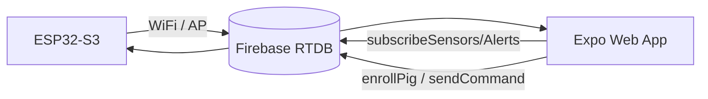

# Capstone Master Plan — Pig Health Monitor

**Last updated:** 2026-05-22  
**Production URL:** https://pig-health-monitor.vercel.app  
**Stack:** ESP32-S3 firmware → Firebase RTDB → Expo web/mobile

---

## Executive summary

| Layer | Status | Notes |
|-------|--------|-------|
| Firmware / Siamese sim | ✅ Done | Phase 1 complete per `docs/task.md` |
| Web deploy (Vercel) | ✅ Live | `npx expo export -p web` |
| Firebase RTDB + rules | ✅ | Not Supabase (docs drift — fix below) |
| Mobile live telemetry | ✅ | `useOfflineTelemetry` → Firebase when online + authed |
| Events / Analytics | ✅ | `subscribeAlerts` / `subscribeRoster` live |
| E2E / demo scripts | ✅ | Routes: `/`, `/events`, `/analytics`, `/nodes`, `/login` |
| Enroll UI | ✅ | `analytics.tsx` → `enrollPig()` (see `RTDB_MIGRATION.md` for device path) |
| Phase 3–4 (dataset, video) | ⏳ Open | Defense prep |

---

## Tab map (current app)

| Tab | Route | Purpose |
|-----|-------|---------|
| Home | `/` | Dashboard + telemetry hook |
| Events | `/events` | Alerts stream |
| Analytics | `/analytics` | Roster, enroll, metrics |
| Nodes | `/nodes` | Device diagnostics |
| Login | `/login` | Farmer/Vet auth |

**Removed (do not use in tests):** `/sensors`, `/alerts`, `/roster`, `/auth`, `/dashboard`

---

## Test battery

Run from repo root:

```bash
chmod +x scripts/test/capstone_smoke.sh
./scripts/test/capstone_smoke.sh
```

| Test | Command | What it proves |
|------|---------|----------------|
| Structure | smoke §1 | Repo layout intact |
| TypeScript | `cd mobile_app && npx tsc --noEmit` | Types compile (known failures: `ScalePressable` sounds path, `GlassCard` + `expo-blur`) |
| Firebase rules | smoke §3 | `database.rules.json` valid JSON |
| Sentinel | `~/.cursor/scripts/verify-sentinel-base.sh` | Hub scripts + soul |
| Providers | `~/.hermes/scripts/probe-providers.py` | Groq/OR/Ollama reachability |
| Vercel | curl production URL | Deploy up |
| Hook wiring | smoke §8 | Firebase listeners in telemetry hook |
| E2E login | `node scripts/test/e2e_test.js` | Puppeteer login flow (needs network) |
| Demo shots | `node scripts/test/demo_recorder.js` | Defense screenshots |
| Firebase seed | `node scripts/firebase/seed_live_thermal.mjs` | RTDB test data (needs service account) |
| Web build | `cd mobile_app && npx expo export -p web` | Production bundle |

---

## Completed this session (2026-05-22)

1. **`useOfflineTelemetry.ts`** — Cloud path uses Firebase subscriptions when user is logged in and network is online; ESP32 AP and guest/offline paths unchanged.
2. **E2E scripts** — `demo_recorder.js`, `e2e_test.js`, `capture_all_views.js`, `run_visual_validation.js`, `debug_screenshot.js` updated to current routes and `/login`.
3. **`analytics.tsx`** — Enroll button calls `enrollPig()` (web: `prompt` for name; native: auto name + alert).
4. **`scripts/test/capstone_smoke.sh`** — One-command smoke battery.

---

## Remaining work (prioritized)

### P0 — Before defense demo

- [ ] **Redeploy Vercel** after merging telemetry + enroll fixes (local changes not on production until deploy).
- [ ] **Login test** on production: `admin@farm.local` / farm password; confirm live sensors populate on Home.
- [ ] **Record demo video** (Phase 4): `node scripts/test/demo_recorder.js` or manual screen capture.

### P1 — Data & docs

- [ ] Align docs: replace Supabase references in `technical_specs.md`, `PIG_HEALTH_MONITOR_COMPLETE_RESEARCH.md` with Firebase RTDB paths (`/users/$uid/...`).
- [ ] Update `docs/task.md` roster tab line → `analytics.tsx`.
- [ ] Refresh `~/.cursor/brain.md` / `current_projects.md` capstone dates.

### P2 — Field / research (Phase 3)

- [ ] TIRPigEar dataset import + transfer learning script.
- [ ] Acoustic SNR calibration in farm or simulated noise.

### P3 — Advisor API

- [ ] `mobile_app/api/chat.js` — wire real keys via env or document mock-only for defense.

### Sentinel (parallel, not capstone code)

- [ ] Telegram `/reset` after Hermes Groq profile change.
- [ ] Tomorrow: OpenRouter quota reset → `active_profile: cloud`, `clear-openrouter-pool.py`, restart gateway.
- [ ] Rotate tokens if `unified_report.sh` ever committed secrets.
- [ ] CodeRabbit GitHub App on Codeberg mirror (CLI already authenticated).

---

## Architecture (live path)



---

## Quick commands

```bash
# Smoke
./scripts/test/capstone_smoke.sh

# Typecheck only
cd mobile_app && npx tsc --noEmit

# Web export
cd mobile_app && npx expo export -p web

# Hermes gateway (after config change)
systemctl --user restart hermes-gateway.service
```
