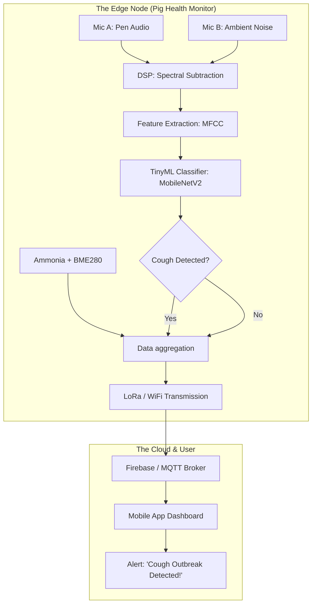

# Project Blueprint: Pig Health Monitor (Multimodal Swine Respiratory Monitor)

**Project Title:** *Pig Health Monitor: A Noise-Robust TinyML Acoustic and Environmental Swine Respiratory Monitor for Open-Air Farms*
**Domain:** Smart Agriculture / Estimating Livestock Health (Precision Livestock Farming - PLF)
**Target Users:** Small-to-Medium Scale Swine Breeders (Backyard/Semi-Commercial)

---

## 1. The Blueprint (Rationale & Objectives)

### 1.1 Problem Statement
Respiratory diseases (like *Mycoplasma hyopneumoniae*) are a leading cause of economic loss in the Philippine swine industry, responsible for up to 40% of mortality in backyard farms. Early detection is critical, but current methods rely on manual observation, which is intermittent and subjective. Commercial acoustic monitors (*e.g., SoundTalks*) are designed for enclosed, climate-controlled European barns and fail in Philippine "open-air" settings due to high ambient noise intrusion (wind, rain, roosters, machinery).

### 1.2 Proposed Solution
**Pig Health Monitor** is a low-cost, edge-computing device designed specifically for tropical, open-air environments. It employs a **multimodal sensing approach**:
1.  **Acoustic Surveillance:** Using a dual-microphone array and a **Differential Noise Subtraction** algorithm to filter ambient noise before processing audio with a **TinyML** model to detect pig coughs.
2.  **Environmental Correlation:** Simultaneous monitoring of **Ammonia (NH3)**, Temperature, and Humidity (THI) to correlate respiratory distress with poor air quality.

### 1.3 Key Innovation (Technical Gap)
*   **Noise-Robustness:** Unlike standard commercial units, this system uses a secondary "Noise Reference" microphone to actively subtract non-pig sounds (roosters/rain) *before* classification.
*   **Edge-Intelligence:** All processing happens on the ESP32-S3 (TinyML), removing the need for 24/7 high-bandwidth cloud audio streaming.
*   **Causality Tracking:** By tracking Ammonia levels alongside Cough counts, the system helps farmers identify the *cause* of the distress, not just the symptom.

---

## 2. The Link (Hardware & Software Stack)

### 2.1 Hardware Architecture
*   **Core Controller:** **ESP32-S3** (High-performance Xtensa LX7, AI acceleration instructions).
*   **Acoustic Sensors:**
    *   **Mic A (Primary):** INMP441 (I2S MEMS) - Directed at the pen.
    *   **Mic B (Reference):** INMP441 (I2S MEMS) - Directed at the environment (roof/outside) for noise cancellation.
*   **Environmental Sensors:**
    *   **Ammonia:** MQ-135 or ZE03-NH3 (Calibrated for NH3).
    *   **Microclimate:** BME280 (Temperature, Humidity, Pressure).
*   **Connectivity:** LoRa (SX1276) for rural areas OR WiFi (if available).
*   **Power:** Solar-ready LiPo battery management module.

### 2.2 Software Architecture
*   **Firmware:** C++/Arduino Framework (PlatformIO).
*   **DSP Pipeline:**
    *   `Input I2S` -> `Spectral Subtraction (Mic A - Mic B)` -> `Mel-Frequency Cepstral Coefficients (MFCC)` -> `TinyML Inference`.
*   **ML Framework:** **Edge Impulse** (for training the Cough vs. Noise model).
*   **Backend/Dashboard:** Firebase (Real-time DB) + React Native Mobile App (User Alerts).

---

## 3. The Architecture (System Flow)

---

## 4. The Style (Academic & Professional)
*   **Design Philosophy:** "Rugged & Functional." The physical enclosure must be IP65 rated (dust/splash proof) to survive a pig pen.
*   **User Interface:** Simple, high-contrast mobile dashboard showing a "Health Score" (0-100%) and "Air Quality Index."
*   **Documentation Tone:** Engineering/Scientific (IEEE Standard). Avoid slang. Focus on metrics: *Accuracy, Latency, False Positive Rate (FPR).*

---

## 5. The Trigger (Timeline & Phases)

### Phase 1: Data Acquisition (Weeks 1-3)
*   [ ] Build the Data Logger (ESP32 + SD Card + 2 Mics).
*   [ ] Deploy in a local backyard farm for 7 days.
*   [ ] Collect "Positive" samples (Pig Coughs) and "Negative" samples (Roosters, Rain, Feeding noise).

### Phase 2: Model Training (Weeks 4-5)
*   [ ] Label data in Edge Impulse.
*   [ ] Train the classifier. Target: >85% Accuracy against "Rooster" noise.
*   [ ] Deploy .tflite model to ESP32-S3.

### Phase 3: Integration & Calibration (Weeks 6-8)
*   [ ] Implement the "Differential Subtraction" code.
*   [ ] Integrate Ammonia/BME280 sensors.
*   [ ] Build the final PCB/Enclosure prototype.

### Phase 4: Validation (Weeks 9-10)
*   [ ] Field test: Compare Pig Health Monitor counts vs. Manual Observation.
*   [ ] Final Thesis Writing & Defense Preparation.
